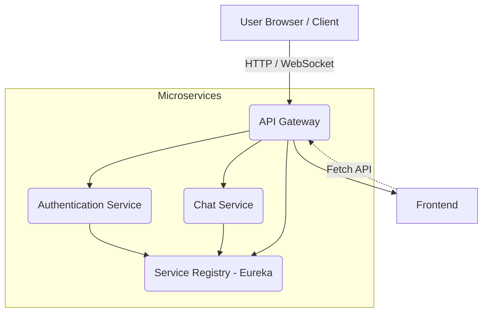

# **AI Powered Chat App — Microservices Architecture**

A scalable, production-grade **AI-powered chat application** built using  
**Spring Boot Microservices, API Gateway, Eureka Service Registry, JWT Authentication,  
WebSockets, and a modern React Frontend.**

This repository serves as the **main hub** that connects all five sub-repositories.

---

## 🚀 **Project Overview**

AI Powered Chat App is designed using a **clean microservices architecture**, separating responsibility into independent modules:
# 📁 Repository Structure

This project is divided into **5 services**, each with a dedicated repository:

| Service | Description | Repository Link |
|--------|-------------|------------------|
| **Gateway Service** | Central entry point, routing, filtering, JWT validation | 🔗 https://github.com/Albin-Reji/ai_powered_chat_app-gateway-service |
| **Authentication Service** | Register, Login, JWT generation & validation | 🔗 https://github.com/Albin-Reji/ai_powered_chat_app-authentication-service |
| **Service Registry** | Eureka service discovery + microservice registration | 🔗 https://github.com/Albin-Reji/ai_powered_chat_app-service-registry |
| **Chat Service** | Chat logic, WebSocket messaging, AI responses | 🔗 https://github.com/Albin-Reji/ai_powered_chat_app-chat-service |
| **Frontend** | React UI for real-time chat + login pages | 🔗 https://github.com/Albin-Reji/ai_powered_chat_app-frontend |
---
- 🔹 **Gateway Service** — API Gateway / Routing  
- 🔹 **Authentication Service** — Login, Tokens, JWT  
- 🔹 **Service Registry** — Eureka-based Discovery  
- 🔹 **Chat Service** — WebSocket Chat + AI Response Layer  
- 🔹 **Frontend** — React-based Modern UI  

This architecture enables:

✔ Scalability  
✔ Modular development  
✔ Independent deployments  
✔ Fault isolation  

---

## 🧩 **Microservices Architecture Overview**




---

# 🛠 Tech Stack

## **Backend (Microservices)**
- Java 17  
- Spring Boot  
- Spring Web  
- Spring Cloud  
- Spring Security  
- Spring Cloud Gateway  
- Spring Cloud Netflix Eureka  
- JWT Authentication  
- WebSocket / STOMP  
- Maven  

## **Frontend**
- React.js  
- Vite  
- Axios  
- Tailwind CSS  
- WebSocket Client  

## **AI Model Layer (Optional Enhancements)**
- Google Gemini API  
- OpenAI GPT  
- HuggingFace Inference API  

---

# ⚙️ Installation & Running the System

## **1️⃣ Clone the root repository**
```bash
git clone https://github.com/Albin-Reji/ai_powered_chat_app.git
cd ai_powered_chat_app

## **2️⃣ Clone all microservices**
```bash
git clone https://github.com/Albin-Reji/ai_powered_chat_app-service-registry
git clone https://github.com/Albin-Reji/ai_powered_chat_app-authentication-service
git clone https://github.com/Albin-Reji/ai_powered_chat_app-chat-service
git clone https://github.com/Albin-Reji/ai_powered_chat_app-gateway-service
git clone https://github.com/Albin-Reji/ai_powered_chat_app-frontend
```
## **3️⃣ Start Microservices (Order is Important)**
🚀 
Step 1: Start Service Registry
```bash
cd ai_powered_chat_app-service-registry
mvn spring-boot:run
```


Step 2: Start Authentication Service
```bash
cd ai_powered_chat_app-authentication-service
mvn spring-boot:run
```


Step 3: Start Chat Service
```bash
cd ai_powered_chat_app-chat-service
mvn spring-boot:run
```


Step 4: Start Gateway Service
```bash
cd ai_powered_chat_app-gateway-service
mvn spring-boot:run
```


Step 5: Start Frontend
```bash
cd ai_powered_chat_app-frontend
npm install
npm run dev
```
